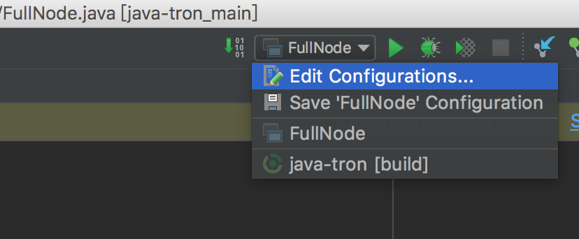
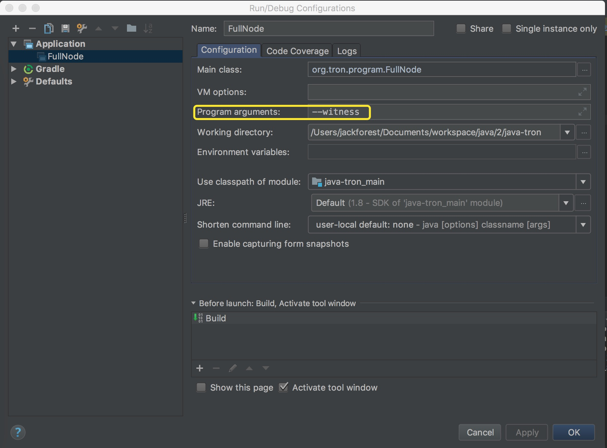

# How to Running

### Running a Super Representative Node for mainnet

* Use the executable JAR(Recommended way)

```bash
java -jar FullNode.jar -p your private key --witness -c your config.conf(Example：/data/lgcy/config.conf)
Example:
java -jar FullNode.jar -p 650950B193DDDDB35B6E48912DD28F7AB0E7140C1BFDEFD493348F02295BD812 --witness -c /data/lgcy/config.conf

```

This is similar to running a private testnet, except that the IPs in the `config.conf` are officially declared by LGCY.

<details>
<summary>Correct output</summary>

```bash

20:43:18.138 INFO  [main] [o.t.p.FullNode](FullNode.java:21) Full node running.
20:43:18.486 INFO  [main] [o.t.c.c.a.Args](Args.java:429) Bind address wasn't set, Punching to identify it...
20:43:18.493 INFO  [main] [o.t.c.c.a.Args](Args.java:433) UDP local bound to: 10.0.8.146
20:43:18.495 INFO  [main] [o.t.c.c.a.Args](Args.java:448) External IP wasn't set, using checkip.amazonaws.com to identify it...
20:43:19.450 INFO  [main] [o.t.c.c.a.Args](Args.java:461) External address identified: 47.74.147.87
20:43:19.599 INFO  [main] [o.s.c.a.AnnotationConfigApplicationContext](AbstractApplicationContext.java:573) Refreshing org.springframework.context.annotation.AnnotationConfigApplicationContext@124c278f: startup date [Fri Apr 27 20:43:19 CST 2018]; root of context hierarchy
20:43:19.972 INFO  [main] [o.s.b.f.a.AutowiredAnnotationBeanPostProcessor](AutowiredAnnotationBeanPostProcessor.java:153) JSR-330 'javax.inject.Inject' annotation found and supported for autowiring
20:43:20.380 INFO  [main] [o.t.c.d.DynamicPropertiesStore](DynamicPropertiesStore.java:244) update latest block header timestamp = 0
20:43:20.383 INFO  [main] [o.t.c.d.DynamicPropertiesStore](DynamicPropertiesStore.java:252) update latest block header number = 0
20:43:20.393 INFO  [main] [o.t.c.d.DynamicPropertiesStore](DynamicPropertiesStore.java:260) update latest block header id = 00
20:43:20.394 INFO  [main] [o.t.c.d.DynamicPropertiesStore](DynamicPropertiesStore.java:265) update state flag = 0
20:43:20.559 INFO  [main] [o.t.c.c.TransactionCapsule](TransactionCapsule.java:83) Transaction create succeeded！
20:43:20.567 INFO  [main] [o.t.c.c.TransactionCapsule](TransactionCapsule.java:83) Transaction create succeeded！
20:43:20.568 INFO  [main] [o.t.c.c.TransactionCapsule](TransactionCapsule.java:83) Transaction create succeeded！
20:43:20.568 INFO  [main] [o.t.c.c.TransactionCapsule](TransactionCapsule.java:83) Transaction create succeeded！
20:43:20.569 INFO  [main] [o.t.c.c.TransactionCapsule](TransactionCapsule.java:83) Transaction create succeeded！
20:43:20.596 INFO  [main] [o.t.c.d.Manager](Manager.java:300) create genesis block
20:43:20.607 INFO  [main] [o.t.c.d.Manager](Manager.java:306) save block: BlockCapsule

```

Then observe whether block synchronization success，If synchronization successfully explains the success of the super node

</details>


### Running a Super Representative Node for private testnet
* use master branch
* You should modify the config.conf
  1. Replace existing entry in genesis.block.witnesses with your address.
  2. Replace existing entry in seed.node ip.list with your ip list.
  3. The first Super Node start, needSyncCheck should be set false
  4. Set p2pversion to 61 

* Use the executable JAR(Recommended way)

```bash
cd build/libs
java -jar FullNode.jar -p your private key --witness -c your config.conf (Example：/data/lgcy/config.conf)
Example:
java -jar FullNode.jar -p 650950B193DDDDB35B6E48912DD28F7AB0E7140C1BFDEFD493348F02295BD812 --witness -c /data/lgcy/config.conf

```
  
<details>
<summary>Show Output</summary>

```bash
> ./gradlew run -Pwitness

> Task :generateProto UP-TO-DATE
Using TaskInputs.file() with something that doesn't resolve to a File object has been deprecated and is scheduled to be removed in Gradle 5.0. Use TaskInputs.files() instead.

> Task :run 
20:39:22.749 INFO [o.t.c.c.a.Args] private.key = 63e62a71ed39e30bac7223097a173924aad5855959de517ff2987b0e0ec89f1a
20:39:22.816 WARN [o.t.c.c.a.Args] localwitness size must be one, get the first one
20:39:22.832 INFO [o.t.p.FullNode] Here is the help message.output-directory/
三月 22, 2018 8:39:23 下午 org.lgcy.core.services.RpcApiService start
信息: Server started, listening on 50051
20:39:23.706 INFO [o.t.c.o.n.GossipLocalNode] listener message
20:39:23.712 INFO [o.t.c.o.n.GossipLocalNode] sync group = a41d27f10194c53703be90c6f8735bb66ffc53aa10ea9024d92dbe7324b1aee3
20:39:23.716 INFO [o.t.c.s.WitnessService] Sleep : 1296 ms,next time:2018-03-22T20:39:25.000+08:00
20:39:23.734 WARN [i.s.t.BootstrapFactory] Env doesn't support epoll transport
20:39:23.746 INFO [i.s.t.TransportImpl] Bound to: 192.168.10.163:7080
20:39:23.803 INFO [o.t.c.n.n.NodeImpl] other peer is nil, please wait ... 
20:39:25.019 WARN [o.t.c.d.Manager] nextFirstSlotTime:[2018-03-22T17:57:20.001+08:00],now[2018-03-22T20:39:25.067+08:00]
20:39:25.019 INFO [o.t.c.s.WitnessService] ScheduledWitness[448d53b2df0cd78158f6f0aecdf60c1c10b15413],slot[1946]
20:39:25.021 INFO [o.t.c.s.WitnessService] It's not my turn
20:39:25.021 INFO [o.t.c.s.WitnessService] Sleep : 4979 ms,next time:2018-03-22T20:39:30.000+08:00
20:39:30.003 WARN [o.t.c.d.Manager] nextFirstSlotTime:[2018-03-22T17:57:20.001+08:00],now[2018-03-22T20:39:30.052+08:00]
20:39:30.003 INFO [o.t.c.s.WitnessService] ScheduledWitness[6c22c1af7bfbb2b0e07148ecba27b56f81a54fcf],slot[1947]
20:39:30.003 INFO [o.t.c.s.WitnessService] It's not my turn
20:39:30.003 INFO [o.t.c.s.WitnessService] Sleep : 4997 ms,next time:2018-03-22T20:39:35.000+08:00
20:39:33.803 INFO [o.t.c.n.n.NodeImpl] other peer is nil, please wait ... 
20:39:35.005 WARN [o.t.c.d.Manager] nextFirstSlotTime:[2018-03-22T17:57:20.001+08:00],now[2018-03-22T20:39:35.054+08:00]
20:39:35.005 INFO [o.t.c.s.WitnessService] ScheduledWitness[48e447ec869216de76cfeeadf0db37a3d1c8246d],slot[1948]
20:39:35.005 INFO [o.t.c.s.WitnessService] It's not my turn

```

</details>

* In IntelliJ IDEA
  
<details>
<summary>

Open the configuration panel:

</summary>



</details>  

<details>
<summary>

In the `Program arguments` option, fill in `--witness`:

</summary>



</details> 
  
Then, run `FullNode::main()` again.

